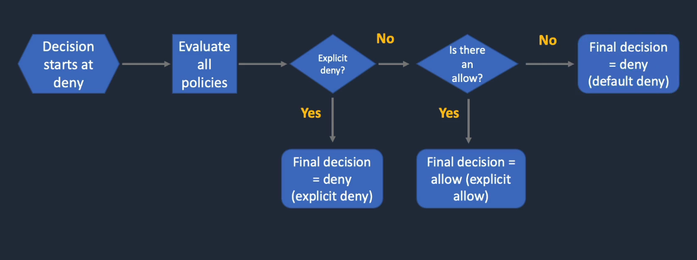

# IAM

AWS IAM (Identity and Access Management) is a service provided by Amazon Web Services (AWS) that helps us manage access to our AWS resources. It's like a security system for our AWS account.

- IAM allows us to create and manage users, groups, and roles. Users represent individual people or entities who need access to our AWS resources. Groups are collections of users with similar access requirements, making it easier to manage permissions. Roles are used to grant temporary access to external entities or services.

- With IAM, we can control and define permissions through policies. Policies are written in JSON format and specify what actions are allowed or denied on specific AWS resources. These policies can be attached to IAM entities (users, groups, or roles) to grant or restrict access to AWS services and resources.

- IAM follows the principle of least privilege, meaning users and entities are given only the necessary permissions required for their tasks, minimizing potential security risks. IAM also provides features like multi-factor authentication (MFA) for added security and an audit trail to track user activity and changes to permissions.

- By using AWS IAM, we can effectively manage and secure access to our AWS resources, ensuring that only authorized individuals have appropriate permissions and actions are logged for accountability and compliance purposes.

Overall, IAM is an essential component of AWS security, providing granular control over access to our AWS account and resources, reducing the risk of unauthorized access and helping maintain a secure environment.

## Components of IAM 

- Users: IAM users represent individual people or entities (such as applications or services) that interact with our AWS resources. Each user has a unique name and security credentials (password or access keys) used for authentication and access control. E.g., We create `developer1` with login credentials so they can log in to the AWS Console and start/stop EC2 instances.

- Groups: IAM groups are collections of users with similar access requirements. Instead of managing permissions for each user individually, we can assign permissions to groups, making it easier to manage access control. Users can be added or removed from groups as needed.

- Roles: IAM roles are used to grant temporary access to AWS resources. It doesn’t have permanent credentials. Instead, it issues temporary security tokens through AWS STS (Security Token Service). E.g., We launch an EC2 instance that needs to access S3. Instead of putting access keys in code (bad idea), we attach an IAM Role to the instance. The role gives temporary credentials to the instance, allowing it to read/write S3.

  There are two different permission relationships involved with IAM roles.

  - Trust policy that answers **Who can assume this role?**
    Example:
    ```json
    {
      "Effect": "Allow",
      "Principal": {
        "Service": "ec2.amazonaws.com"
      },
      "Action": "sts:AssumeRole"
    }
    ```
  - Permissions policy that answers **What can the role do after it is assumed?**  
    Example:
    ```json
    {
      "Effect": "Allow",
      "Action": [
        "s3:GetObject"
      ],
      "Resource": "arn:aws:s3:::my-bucket/*"
    }
    ```
    This distinction applies to both normal roles and service-linked roles.

- Policies: IAM policies are JSON documents that define permissions. Policies specify the actions that can be performed on AWS resources and the resources to which the actions apply. Policies can be attached to users, groups, or roles to control access. IAM provides both AWS managed policies (predefined policies maintained by AWS) and customer managed policies (policies created and managed by us).

## User Creation
We're using our **root** user to create the user.
- First, search for IAM (Identity and Access Management) in the console searchbox.
- Under **Access Management**, select the 'IAM Users' section and click the **Create user** button to add a new user.
- Provide a name for the user and check the **Provide user access to the AWS Management Console** box.
- Select **Autogenerated Password** radio button and check the **Users must create a new password at next sign-in** box.
- Click on **Next**
- Select **Add user to group** under **Set permissions**. Select the checkboxes of the groups we want our user to be a part of. If we don't select any group, the user won't belong to any group. Click on **Next**
- Review the settings. `IAMUserChangePassword` is the only policy attached to the newly created user by default (to enable user to change the password).
- Click on **Create user**.
- We can download the user credentials by clicking on the **Download .csv file** button.
> The console sign-in URL contains the AWS Account ID of the new user.

## AWS Managed Policy vs Customer Managed Policy
AWS managed policies are prebuilt and maintained by AWS to make it easy to grant standard/common permissions, such as read-only or full access to specific services like S3. AWS can silently update these policies and as a result an user may suddenly have more access.

In contrast, customer managed policies are used when an organization/user needs to define very specific, tailored permissions that are not covered by the default offerings. It offers fine-grained control, stability and follows the principle of least privilege.

>  AWS Managed → convenience, less control ; Customer Managed → control, more effort

## Policy Evaluation



## Service-Linked Roles
A service-linked role is a special IAM role that is directly associated with a specific AWS service. It provides the service with the permissions it needs to perform actions in the customer's AWS account. Unlike a normal IAM role, AWS manages much of its creation, trust relationship, permissions, and lifecycle. The role is intended specifically for that AWS service.

Imagine we create an AWS service that needs to manage other AWS resources. For example, Auto Scaling might need to:

- interact with EC2
- create or terminate instances
- interact with Elastic Load Balancing
- publish metrics

AWS needs an identity with permissions to perform those operations.

Historically, we might have had to manually create a role and configure its trust relationship. That becomes annoying very quickly. So AWS introduced service-linked roles.

AWS creates the appropriate role with the appropriate trust relationship and permissions. We don't have to design the role from scratch.

**Difference b/w normal IAM role and Service-Linked role**  
A normal IAM role is a general-purpose identity that we create and configure, whereas a service-linked role is specifically tied to one AWS service and is primarily managed by AWS for that service's operations.

> Suppose we enable a service that requires one. We don't necessarily have to manually create the Service-Linked role, the service can create it for us.

| Normal IAM Role                         | Service-Linked Role                        |
| --------------------------------------- | ------------------------------------------ |
| General-purpose identity                | Dedicated to one AWS service               |
| We create/manage it                    | AWS service creates/manages it             |
| Can be used by various trusted entities | Can be assumed by its linked AWS service   |
| We generally control its trust policy  | Trust relationship is controlled by AWS    |
| Permissions can be customized           | Permissions are defined by AWS             |
| We decide how to use it                | AWS service uses it for its own operations |

## Importance of `sts:AssumeRole`
Suppose, Alice wants to assume **DeveloperRole** so that she perform some activity. Alice isn't directly using her own permissions for those operations. She obtains temporary credentials associated with **DeveloperRole**.

The API operation responsible for this is `sts:AssumeRole`

For AssumeRole, there are two sides.

- **Alice's permissions**  
  Alice needs permission to call:
  ```
  {
    "Effect": "Allow",
    "Action": "sts:AssumeRole",
    "Resource": "arn:aws:iam::123456789012:role/DeveloperRole"
  }
  ```
  This says, Alice is allowed to attempt to assume DeveloperRole. But that alone isn't sufficient.

- **The role's trust policy**

  DeveloperRole must trust Alice's principal. For example:
  ```
  {
    "Version": "2012-10-17",
    "Statement": [
      {
        "Effect": "Allow",
        "Principal": {
          "AWS": "arn:aws:iam::123456789012:user/Alice"
        },
        "Action": "sts:AssumeRole"
      }
    ]
  }
  ```
So we have:
```
Alice's identity policy
        |
        | "I can call AssumeRole on DeveloperRole"
        ↓
DeveloperRole
        |
        | Trust policy:
        | "I trust Alice"
        ↓
Assumption succeeds
```
Both sides matter.

Effectively, to assume an IAM role, the calling principal generally needs permission to perform **sts:AssumeRole** on the target role, and the target role's trust policy must trust the calling principal.

## Importance of `iam:AssumeRole`
Suppose Alice wants to launch an EC2 instance.

The EC2 instance needs permissions to access S3 via **s3:GetObject**

So a role **EC2-S3-Role** is created with

```json
{
  "Effect": "Allow",
  "Action": "s3:GetObject",
  "Resource": "arn:aws:s3:::my-bucket/*"
}
```
The role's trust policy says:

```json
{
  "Effect": "Allow",
  "Principal": {
    "Service": "ec2.amazonaws.com"
  },
  "Action": "sts:AssumeRole"
}
```

Now when Alice launches EC2, she herself isn't assuming `EC2-S3-Role`. **EC2 is going to use it.**

That is where **iam:PassRole** comes in. 

Suppose Alice has:

```json
{
  "Effect": "Allow",
  "Action": "iam:PassRole",
  "Resource": "arn:aws:iam::123456789012:role/EC2-S3-Role"
}
```

This means:

> Alice is allowed to tell an AWS service to use this IAM role.

But Alice does **not** receive the permissions of `EC2-S3-Role`.

That's the crucial distinction.

> The role must trust the service that is going to use it.

### One Catch

Suppose we grant:

```json
{
  "Effect": "Allow",
  "Action": "iam:PassRole",
  "Resource": "*"
}
```

Combined with the ability to create resources that can use roles, this can be extremely powerful.

For example:

```text
iam:PassRole *
        +
ec2:RunInstances
```

could potentially allow a user to launch an EC2 instance with a highly privileged role. So least privilege matters enormously here.

We should always prefer:

```json
{
  "Effect": "Allow",
  "Action": "iam:PassRole",
  "Resource": "arn:aws:iam::123456789012:role/ApplicationEC2Role"
}
```

instead of:

```json
"Resource": "*"
```

##  `AssumeRole` vs `PassRole`
|                               | `sts:AssumeRole`              | `iam:PassRole`                       |
| ----------------------------- | ----------------------------- | ------------------------------------ |
| Purpose                       | Obtain credentials for a role | Give a service a role to use         |
| Who ultimately uses role?     | Calling principal             | AWS service                          |
| Temporary credentials?        | Yes                           | Not directly                         |
| API                           | STS `AssumeRole`              | IAM authorization check              |
| Example                       | Developer becomes AdminRole   | Developer launches EC2 using AppRole |
| Trust policy involved?        | Yes                           | The service must trust the role      |
| Caller gets role permissions? | Yes, through temporary creds  | No                                   |

## References
- [IAM JSON policy element reference](https://docs.aws.amazon.com/IAM/latest/UserGuide/reference_policies.html)
- [Actions, resources, and condition keys for AWS services](https://docs.aws.amazon.com/IAM/latest/UserGuide/reference_policies_actions-resources-contextkeys.html)