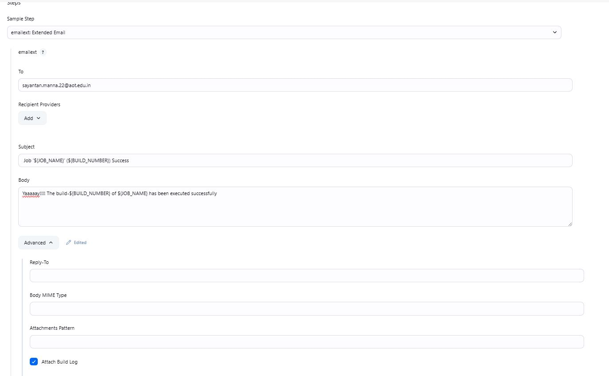

## Introduction
Jenkins allows sending email notifications for build status updates (e.g., success, failure, unstable). Here, we would use **Email Extension** plugin for this purpose. This plugin comes under the plugins installed via **Install Suggested Plugins**. Also, we'll be using **Gmail** as our SMTP server.

## Configuring Gmail
We need to generate an **App password** from our gmail account to authenticate with Jenkins.

> Make sure 2-step verification is active
- Go to **Manage your Google Account**

- Search for **App passwords** and create one by providing the **App name**.

- Copy the displayed password.

- In Jenkins, set up a credential of type **Username with password**.

  - Use the email address as **Username**. This will be used to send the email.
  - Use the copied password as **Password**.
  - Provide an ID (e.g. `gmail-creds`) for convenience.

## Configuring Jenkins
> Make sure to allow port 465 of Jenkins master for SMTPS.
- Go to **Manage Jenkins** > **System**.

- Under **Jenkins Location**, set up the **System Admin e-mail address** as `Jenkins <steve@org.com>` or `sayantan@jenkins.com`. Here, the email address (i.e. `steve@org.com` or `sayantan@jenkins.com`) will be overridden by the email address configured at the previous step. 

- Under **Extended E-mail Notification**
  - Set the **SMTP server** as
    ```
    smtp.gmail.com
    ```
  - Set the **SMTP Port** as `465`

  - Click on **Advanced**
   
    - Add the previously configured credential.
    - Check the box for **Use SSL**.
  
  - Check the box for **Enable Debug Mode** (Optional)

- Click on **Save** .

## Example
We created a simple **Pipeline** job with declarative pipeline.

 We'd use the **emailext: Extended Email** option provided by the **Pipeline Syntax Snippet Generator** to write the syntax for sending email.



### Pipeline Script
```groovy
pipeline {
    agent any

    stages {
        stage('Hello') {
            steps {
                echo 'Hello World'
            }
        }
    }
    post {
      success {
        emailext attachLog: true, body: 'Yaaaaay!!!! The build-${BUILD_NUMBER} of ${JOB_NAME} has been executed successfully', subject: ' Job \'${JOB_NAME}\' (${BUILD_NUMBER}) Success', to: 'sayantan.manna.22@aot.edu.in'      
      }
      failure {
        emailext attachLog: true, body: 'Test Failure', subject: 'Test email', to: 'sayantan.manna.22@aot.edu.in'
      }
    }

}

```
After the script runs successfully, we receive the following email containing a **log** file:
```
To: sayantan.manna.22@aot.edu.in
From: Jenkins <sayantanmanna06@gmail.com>
Subject: Job 'test-email' (8) Success 
Body: Yaaaaay!!!! The build-8 of test-email has been executed successfully
```

As shown above, we can dynamically include environment variables in email content. For more examples, refer to 
- **Global Variables Reference** available at `http://<JENKINS_URL>:8080/pipeline-syntax/globals`
- Go to **Manage Jenkins** > **System**. Under **Extended E-mail Notification**, click on the **?** associated with **Content Token Reference** to get a list of the supported tokens by **Email Extension** Plugin.

## References
- [Configure Email Notification in Jenkins Pipeline Using the Email Extension Plugin](https://youtu.be/CGSwDpDfEMw?si=pDGxA74qUE5uL5fK)
- [Configure Email Notification in Jenkins Pipeline Using the Mailer Plugin](https://youtu.be/OOCvCdZLAhc?si=67WH1pTLsdq-jcG4)