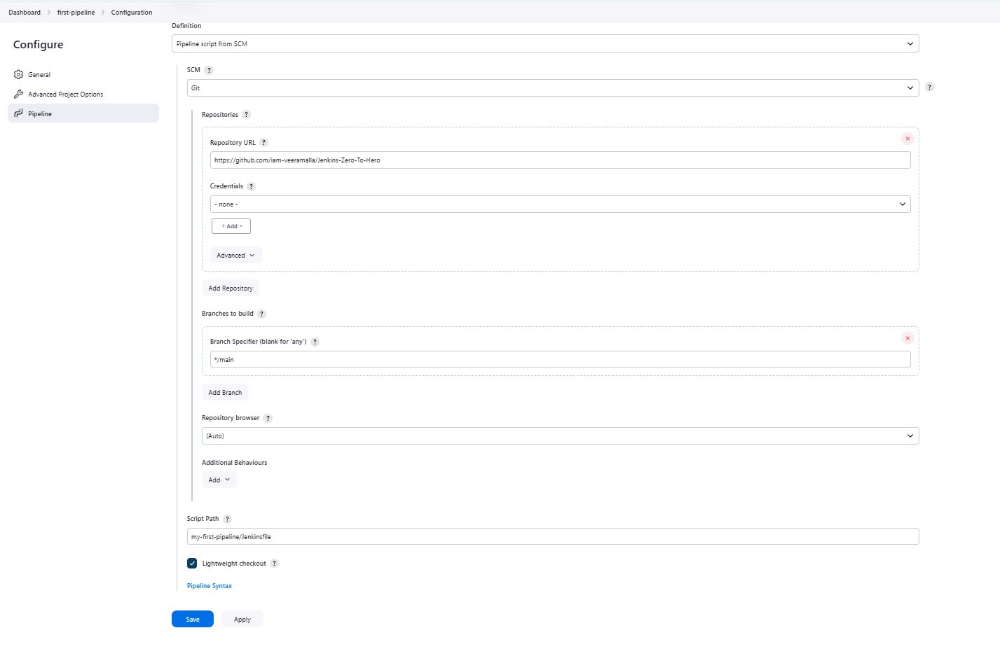

## Jenkins Pipeline
There are multiple ways to create a pipeline in Jenkins e.g., **Freestyle project**, **Pipeline**, **Multi-configuration project** etc.

Jenkins freestyle projects are the traditional method of configuring jobs in Jenkins, where most configurations are done through the GUI (without the need to write any code)by setting parameters, build triggers, and post-build actions. While Jenkins freestyle projects are simple and quick to set up, they come with certain limitations, sucn as:

- Job configurations in freestyle projects are stored in Jenkins itself, making it hard to track changes or collaborate on job configurations.

- We need to duplicate configurations across multiple jobs for similar workflows, which is error-prone and time-consuming, i.e. lack of reusability.

- Freestyle jobs struggle to handle complex workflows, especially those with multiple stages or conditional steps.

To overcome these issues, Pipeline approach is used. It is a declarative in nature and uses Groovy scripting. A `Jenkinsfile` contains the configuration of Jenkins Pipeline. We shall focus on the Declarative syntax of writing a Jenkinsfile.

### Default Storage Locations

Every time we create a new job (i.e. a pipeline or freestyle project etc.) in Jenkins, a new folder is created at `/var/lib/jenkins/jobs/`.

- Whenever a job is executed, a new build is created. Each job stores its related build-data in the directory `/var/lib/jenkins/jobs/{JOBNAME}`

Each job folder contains:

- The job configuration file is `/var/lib/jenkins/jobs/{JOBNAME}/config.xml`

- The job builds are stored in `/var/lib/jenkins/jobs/{JOBNAME}/builds/`

However, the files related to our project (e.g. source code pulled from SCM) is stored at `/var/lib/jenkins/workspace/{JOBNAME}/` by default.

### Declarative Pipeline fundamentals
This is the basic structure of a Jenkinsfile:
```groovy

pipeline {  //block defines all the work done throughout your entire Pipeline.

    //The agent directive, which is required, instructs Jenkins to allocate an executor and workspace for the Pipeline.

    agent any   // Execute this Pipeline or any of its stages, on any available agent. Since no external agent is specified, jenkins uses its built-in agent or the same machine where the Jenkins controller is running to execute the jobs 
    
    stages {
        stage('Build') {    // Defines the "Build" stage
            steps {
                //Perform some steps related to the "Build" stage.
            }
        }
        stage('Test') {
            steps {
                //
            }
        }
        stage('Deploy') {
            steps {
                //
            }
        }
    }
}
```
We can also refer to the pipeline-syntax generator at `http://<current_IP_of_ec2>:8080/pipeline-syntax` and the directive-generator at `http://<current_IP_of_ec2>:8080/directive-generator`

### Building the first Pipeline
- Using pipeline script, check out the steps [here](https://www.jenkins.io/doc/book/pipeline/getting-started/#through-the-classic-ui)

- Using Pipeline Script from SCM,
  

  - The jenkins file in the [git repo](https://github.com/iam-veeramalla/Jenkins-Zero-To-Hero) looks like:
  
    ```groovy
    pipeline {
        agent {
            docker { image 'node:16-alpine' } 
        }
        stages {
            stage('Test') {
                steps {
                    sh 'node --version'
                }
            }
        }
    }
    ```
    Explanation
    - first, Jenkins gets the Jenkinsfile from the repo by cloning it automatically. This is the default behavior in case of declarative pipeline. 
    - Builds a container based on the given image to run the script
    - removes the container

## Plugin
- To get a nice view of the pipeline, install **Pipeline: Stage View** plugin.


## Adding Credentials
To add credentials (e.g. private-SSHkey, GitHub API token, DockerHub secret token etc.):
- Go to **Manage Jenkins** > **Credentials**
- Click on **(global)** Domain
- Click on **Add Credentials**
  - select the appropriate alternative from the dropdown of **Kind** .

  - Leave the **Scope** to its default value. Provide a name in the **ID** and an optional description in **Description**.

  - In the **Username**, add the username. Leave the **Treat username as secret** checkbox as empty.

  - In the **Password**, add the password.

  - Click on **Create** .

## Referenes
- [Pipeline](https://www.jenkins.io/doc/book/pipeline/)

