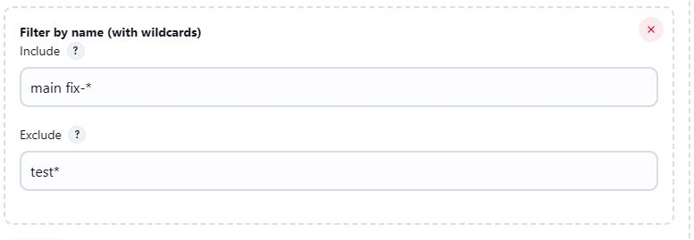

## 🚀 Why Use Multibranch Pipelines?
A Multibranch Pipeline in Jenkins automatically discovers, manages, and executes Pipelines for different branches in a source code repository.

✅ **Automates Pipeline Creation**: No need to create separate jobs for each branch manually.  
✅ **Branch-Specific Pipelines**: Each branch can have its own Jenkinsfile defining its CI/CD process.  
✅ **Efficient Builds**: Only builds active branches, ignoring inactive ones.  
✅ **Supports Pull Requests**: Can automatically test feature branches before merging.

## Create a Multibranch Pipeline Job

1. **Go to Jenkins Dashboard** → Click on **New Item**.  
2. Enter a **Job Name** and select **Multibranch Pipeline**.  
3. Click **OK** to proceed.

#### Configure the Multibranch Pipeline

1. Under **Branch Sources**, click **Add Source** → **GitHub**.

2. If authentication is required, configure Git credentials.

3. Enter the repository URL (e.g., `https://github.com/your-repo.git`) and click on **Validate** .

4. Under **Behaviours**, without changing the defaults, click on **Add** to incorporate additional behavior. 

   - If we choose not to discover all the branches from the repo, we can opt for the **Filter by name (with wildcards)** method to discover specific branches from the repo.

     E.g., Here we only want to work with **main** branch or the branches with their name starting with **fix-** and exclude any branch with its name starting with **test**.

     

   - To remove untracked files and reset the workspace, ensuring a clean build environment, select **Clean after checkout** and **Clean before checkout**. Also, check the box for **Delete untracked nested repositories** in both cases.
   

6. Under **Build Configuration**, select **by Jenkinsfile** as **Mode** and define its location in **Script Path** (default: Jenkinsfile).

   - We can also specify some other path e.g. `demo/Jenkinsfile` when the Jenkinsfile is located inside **demo** folder at root.

7. Check **Discard old items** box and specify **Days to keep old items** and **Max # of old items to keep** .

8. Click **Save**. This causes the pipeline to scan the repository. 

Jenkins will now create pipeline jobs only for the branches containing a `Jenkinsfile` in the repository.

> Basically, a Multibranch Pipeline Job is a folder containing multiple pipeline jobs, each corresponding to a particular branch in the repo.

## References
- [Jenkins Multibranch Pipeline with Git](https://youtu.be/B_2FXWI6CWg?si=TDZN4Dj6htLCrJy8) 

- [Jenkins Multibranch Pipeline with GitHub](https://youtu.be/aDmeeVDrp0o?si=rv7gbJVT3iZR_JvX) 

- [Jenkins Multibranch Pipeline Tutorial For Beginners](https://devopscube.com/jenkins-multibranch-pipeline-tutorial/)

