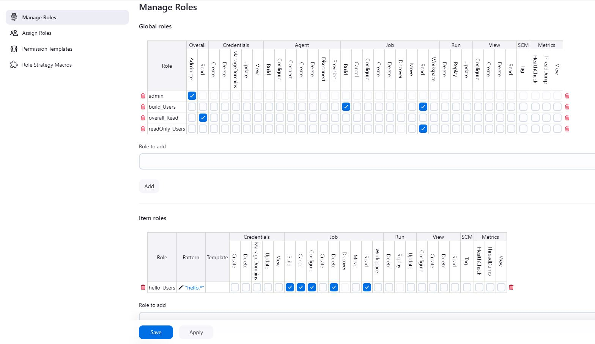
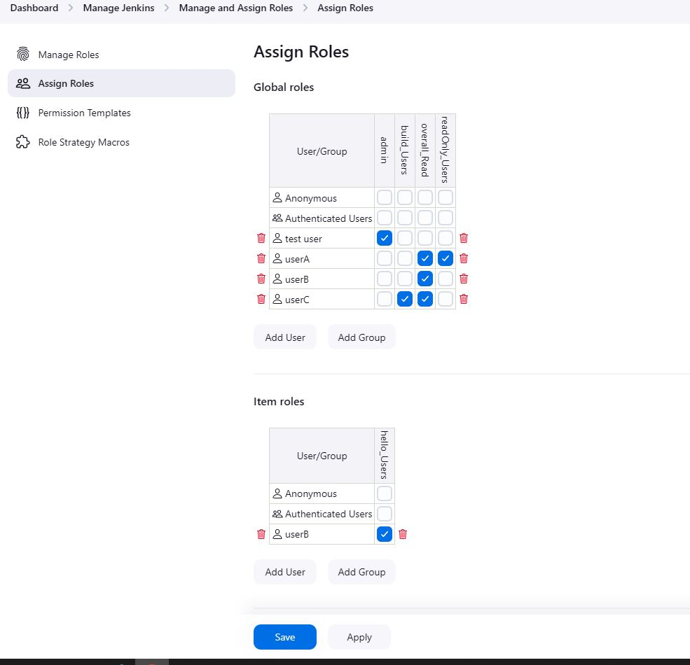

By default, when you create a user in Jenkins, it can access almost everything. Hence, managing users and roles in Jenkins is essential to prevent unauthorized access and simplification of management.

The user created while setting up Jenkins is the primary user. However, we can create other users as well. 

Let's create the following three users with three types of access:
- UserA --> Read Only Access
- UserB --> Read and Manage jobs starting with "hello"
- UserC --> Only build jobs

## Steps
- Create new user: navigate to **Jenkins Dashboard** → **Manage Jenkins** → **Users**. Click on **Create User**. Enter the user name, password, full name and email-address and then click **Create User** button. Create UserA, UserB and UserC by following these steps.

- Install **Role-based Authorization Strategy** plugin.
- After successful installation of plugin, Go to **Manage Jenkins** → **Security** and select the **Role-Based Strategy** under the **Authorization** section, click on **Apply** and **Save**.

- Now, go to **Manage Jenkins** → **Manage and Assign Roles**.

Under **Manage Roles**,

- **Global** roles -> Global roles govern access permissions that affect the entire Jenkins system, beyond individual jobs, folders, or pipelines. 

  In the **Overall** section,
  - `Read`: Allows users to view the Jenkins interface without making any changes. *This is mandatory for all users*.
  - `Administer`: Grants complete administrative control over the Jenkins system.

  The **View** section allows to define permissions related to viewing and modifying the **Dashboard** i.e. by organizing and displaying jobs in a customized manner. Any changes to the **Dashboard** will be visible to all the users, as the **Dashboard** is the same for all.

Here, we create three roles i.e. **readOnly_Users**, **overall_Read**, **build_Users**.

- **Item** roles -> These are specific to particular jobs or folders. They provide granular permissions to individual projects. We can also set a regular expression pattern for matching items, in the **Pattern** text-box. Here, users with **hello_Users** role can access and manage the jobs that start with **hello**. The pattern used is `hello.*`. For further details, check out [this](https://plugins.jenkins.io/role-strategy/).

Hover the mouse pointer on the columns containing permissions for more details.

Under **Assign Roles**, 

- we assign the created roles to different users. The **Global roles** section is used to assign the **Global** roles and the **Item roles** section assign the **Item**-specific roles.

  **userB** is assigned two roles i.e. **overall_Read** (provides overall read permission) and **hello_Users** (provides job-related permissions)

