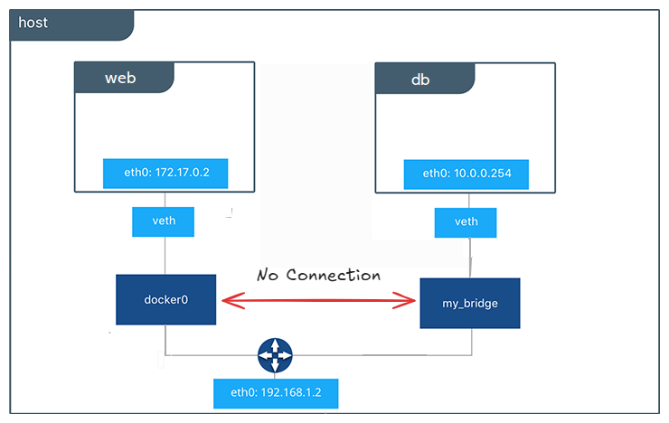

### WHAT
Container networking refers to the ability for containers to connect to and communicate with each other, or to non-Docker workloads. However, sometimes we want some containers totally isolated from other ones. The solutions for both of the issues are offered by docker networking.

### HOW
Containers have networking enabled by default, and they can make outgoing connections. A container has no information about what kind of network it's attached to, or whether their peers are also Docker workloads or not. A container only sees a network interface with an IP address, a gateway, a routing table, DNS services, and other networking details. That is, unless the container uses the `none` network driver.

Useful network drivers provided by Docker:

- Whenever we create a container, it is connected to Docker's default bridge network **docker0**, aka **bridge** . A container is connected to **docker0** using a **veth** interface. One end of the **veth** pair is placed inside the container's network namespace, acting as its network interface, while the other end is attached to **docker0**, enabling communication with other containers on the same bridge only. Containers on the default bridge network can only access each other by IP addresses.

  

- In **host** networking, a container directly shares the networking namespace of the Docker host and the container doesn't get its own IP-address allocated. Port mapping also doesn't work. Anyone having access to the host can have access to the container. Hence it can be a security risk.

- Overlay Networking: This mode enables communication between containers across multiple Docker host machines, allowing containers to be connected to a single network even when they are running on different hosts.

### User-defined Networks
We can create custom, user-defined networks, and connect multiple containers to the same network. Once connected to a user-defined network, containers can communicate with each other using container IP addresses or container names.

Here, we shall create bridge networks. Containers in different bridge can not communicate with each other. A container can be connected to more than one networks.

### Useful Commands

- `docker network create network_name` : Creates a new **bridge** network.

- `docker network connect network_name container1_id`: Connects a running container to a network. You can connect a container by name or by ID.

- `docker network disconnect network_name container1_id` : Disconnects container1 from the network. The container must be running to disconnect it from the network. We can use name of the container also.

- `docker network ls` : Lists all the networks.

- `docker network rm network1_id network2_id...` : Removes one or more networks. To remove a network, we must first disconnect any containers connected to it. We can use name of the networks as well.

- `docker run -itd --network=my-net busybox` : To add busybox container to the my-net network.

- `docker run -itd --network=host busybox` : To add busybox container to the host network. The container will not have any IP address as it will use the same IP address and network configuration as the host.

### Important

By default, Compose sets up a separate network for our app. Each container for a service joins that network and is both reachable by other containers on that network, and discoverable by the service's name. 

Our app's network is given a name based on the project name.

Go through the [networking documentation](https://docs.docker.com/engine/network/) and [compose networking](https://docs.docker.com/compose/networking/) for more details.